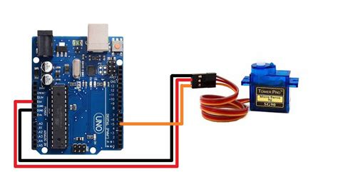

## servo_motor_control

Install Servo library software module: 

#include <Servo.h>

 Create a servo object:

    Servo myservo; 

 Create a variable to store the servo position:
 
    int pos = 0;   

## Microcontroller Setup 

 Select servo motor control pin: 

     myservo.attach(9); 

## Microcontroller Loop

We sweep from pos = 0 to pos = 180 in steps of 1 degree:

    myservo.write(pos);     

telling servo to go to position pos each time and waiting  waiting 15 ms for the servo to reach the position
  
    delay(15);                      
    
  then goes from 180 degrees to 0 degrees with the same step, waiting 15 ms for the servo to reach the position
    
